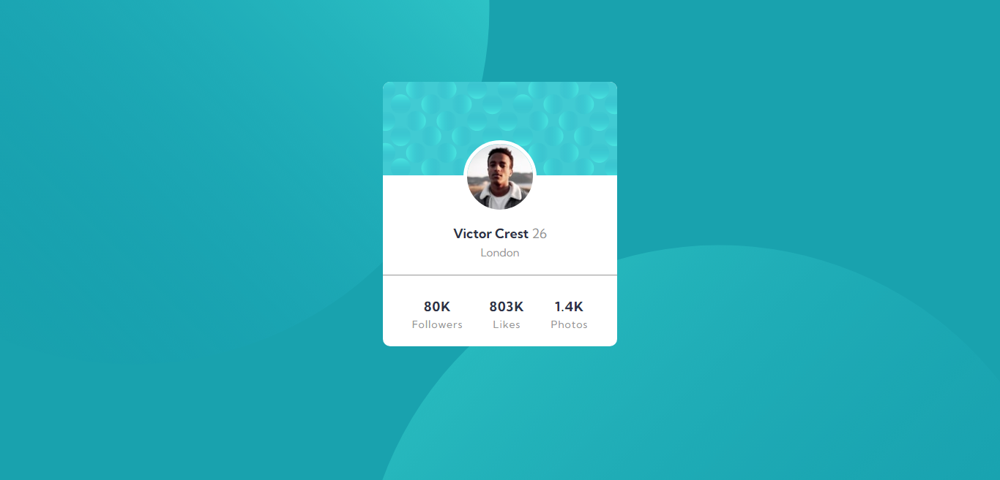
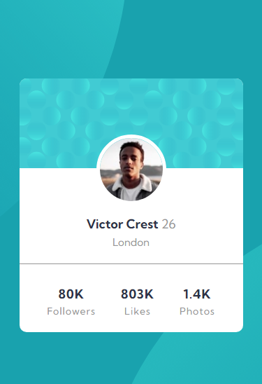

# Frontend Mentor - Profile card component solution

This is a solution to the [Profile card component challenge on Frontend Mentor](https://www.frontendmentor.io/challenges/profile-card-component-cfArpWshJ). 

## Table of contents

- [Overview](#overview)
  - [The challenge](#the-challenge)
  - [Screenshot](#screenshot)
  - [Links](#links)
- [My process](#my-process)
  - [Built with](#built-with)
  - [What I learned](#what-i-learned)
  - [Useful resources](#useful-resources)
- [Author](#author)

## Overview

### The challenge

- Build out the project to the designs provided

### Screenshot

### Links

- Solution: [Solution url click here](https://github.com/Sandesh4141/Profile-Card-Component)
- Live Site: [Live site click here](https://blissful-minsky-47f301.netlify.app/)

## My process

### Built with

- Semantic HTML5 markup
- CSS custom properties
- Flexbox
- Mobile-first workflow

### Useful resources

- [W3schools](https://www.w3schools.com) - Understadable written notes.
- [mdn webdocs](https://developer.mozilla.org/en-US/) - This is an amazing article which helped me finally understand everything that I need to build this project.

## Author

- Frontend Mentor - [@Sandesh4141](https://www.frontendmentor.io/profile/Sandesh4141)
- Twitter - [@sandesh-sp](https://www.twitter.com/@Sandesh32971351)
- Instagram - [@sandesh.sp41](https://www.instagram.com/sandesh.sp41)
